# HackPark - THM 

## Task 1: Deploy the vulnerable Windows machine.

Q1) Deploy the machine and access its web server.


Ans: No answer needed

Q2) Whats the name of the clown displayed on the homepage?

Ans: pennywise

## Task 2: Using hydra to brute-force a login

Q3) We need to find a login page to attack and identify what type of request the form is making to the webserver. Typically, web servers make two types of requests, a GET request which is used to request data from a webserver and a POST request which is used to send data to a server.

You can check what request a form is making by right clicking on the login form, inspecting the element and then reading the value in the method field. You can also identify this if you are intercepting the traffic through BurpSuite (other HTTP methods can be found here (opens in new tab)).

What request type is the Windows website login form using?

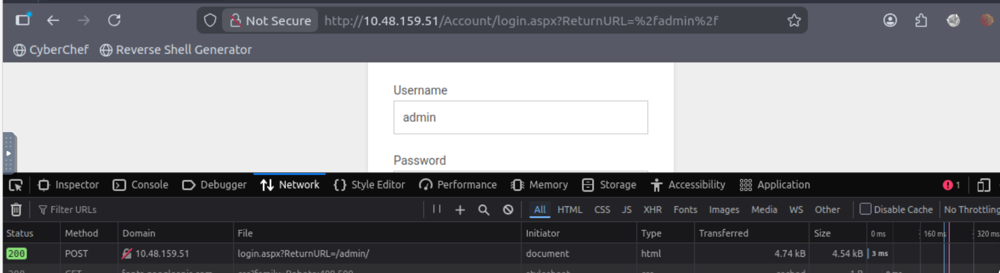

Ans: POST

Q4) Now we know the request type and have a URL for the login form, we can get started brute-forcing an account.

Run the following command but fill in the blanks:

hydra -l **username** -P /usr/share/wordlists/**wordlist** **ip** http-post-form

Guess a username, choose a password wordlist and gain credentials to a user account!

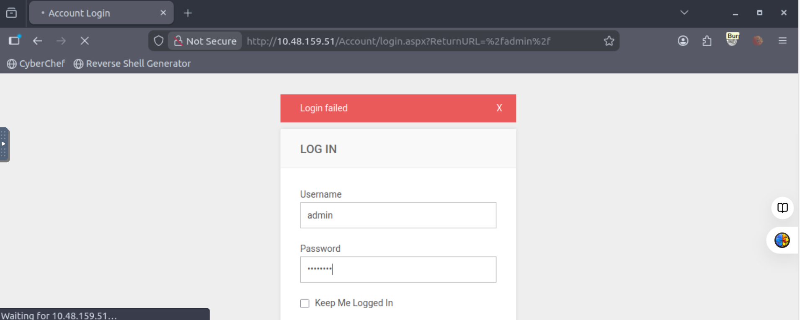

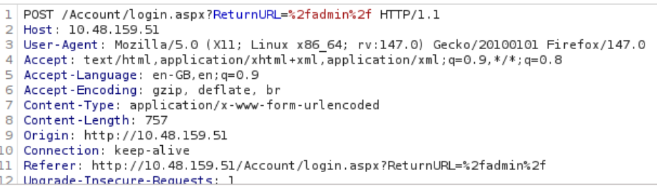


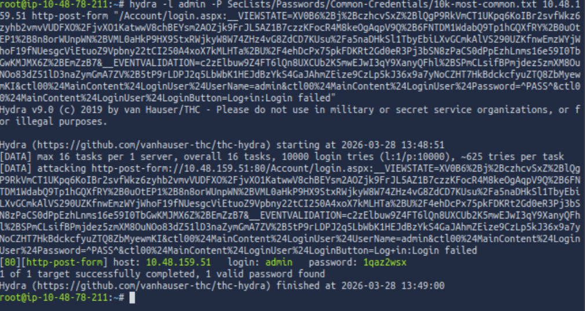

Ans: 1qaz2wsx

## Hydra Cheat Sheet

Hydra is a powerful brute-force tool used in penetration testing to crack login credentials. It supports multiple protocols such as HTTP, FTP, SSH, SMTP, SMB, RDP, and more.

While commonly used for web login forms, Hydra can also attack various network services efficiently.

---

##  Basic Usage

```bash
hydra -P <wordlist> -v <ip> <protocol>
```
**Description:**
Performs brute-force attack using a password list against a chosen protocol.

Brute Force Usernames and Passwords
hydra -v -V -u -L **username_list** -P **password_list** -t 1 **ip** **protocol**

**Description:**
Tries all combinations of usernames and passwords.

Options Explained:

- -vV → Verbose mode (shows each login attempt)
- -L → Username list
- -P → Password list
- -t 1 → Number of parallel threads
- -u → Loop around users first, then passwords

## RDP Brute Force
```bash
hydra -t 1 -V -f -l <username> -P <wordlist> rdp://<ip>
```

**Description:**
Used to brute-force Windows Remote Desktop credentials.

**Options:**

- -f → Stop after finding a valid login
- -V → Show each attempt

## HTTP POST Form Attack

```
hydra -l **username** -P <password_list> **ip** http-post-form "/wp-login.php:log=^USER^&pwd=^PASS^&wp-submit=Log+In&testcookie=1:S=Location"
```

**Description:**
Used to brute-force login forms on web applications.

**Important Parameters:**

- ^USER^ → Placeholder for username
- ^PASS^ → Placeholder for password
- S=Location → Indicates successful login (response condition)

## Task 3: Compromise the machine

Q5) Now you have logged into the website, are you able to identify the version of the BlogEngine?

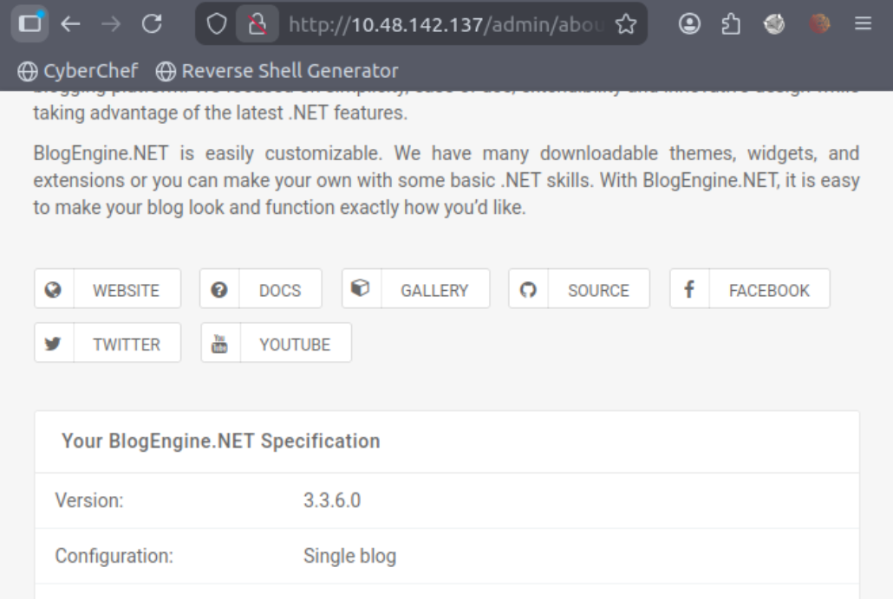

**Ans:** 3.3.6.0

Q6) Use the exploit database archive (opens in new tab) to find an exploit to gain a reverse shell on this system.

What is the CVE?

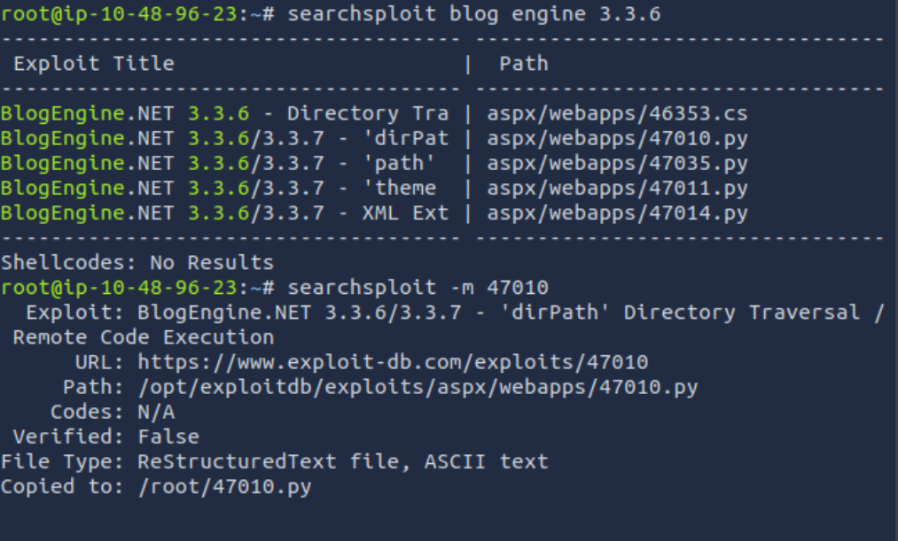

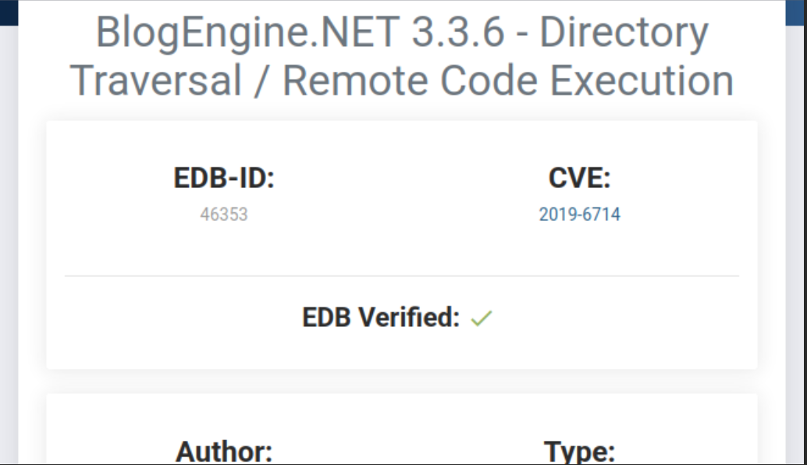

**Ans:** CVE-2019-6714

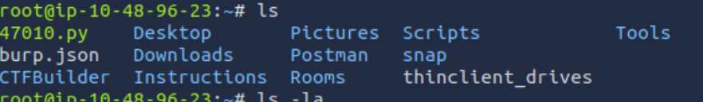

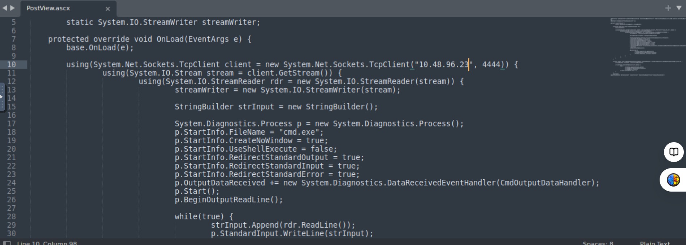

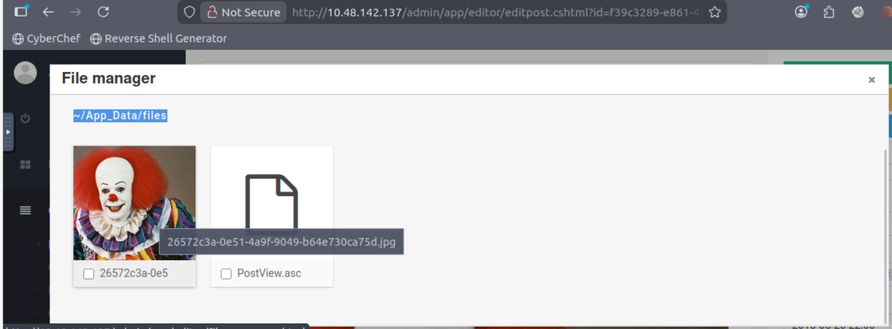

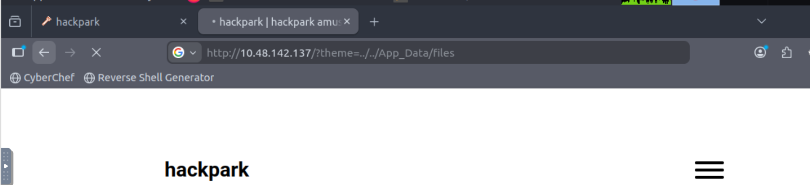

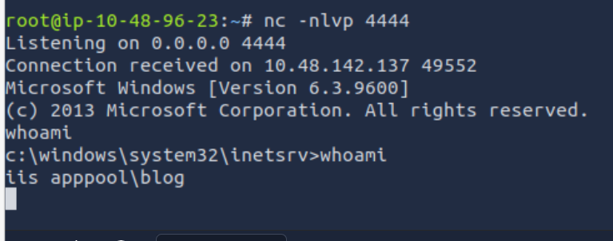

**Ans:** iis apppool\blog

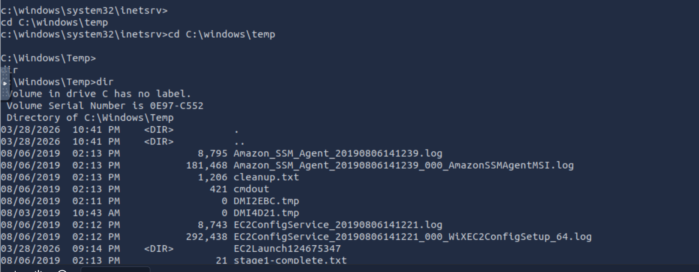

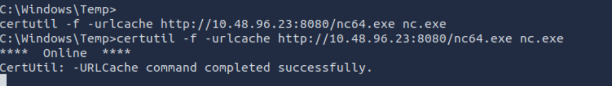

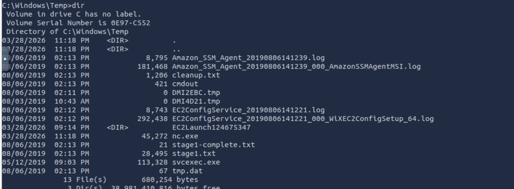

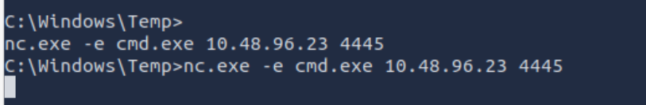

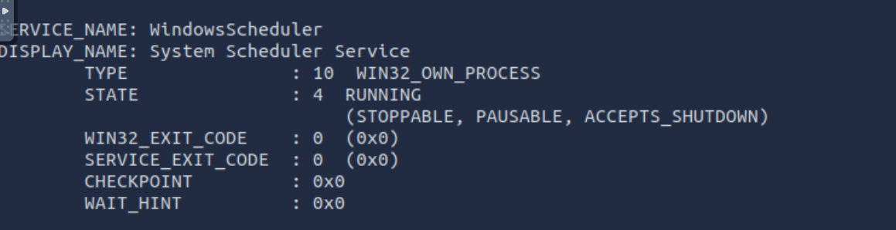

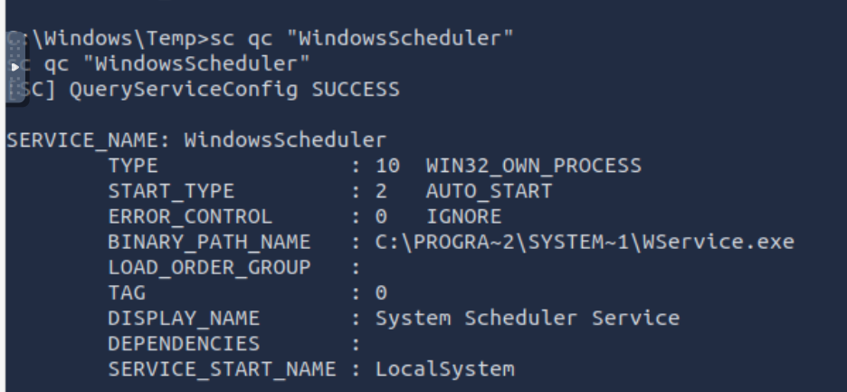

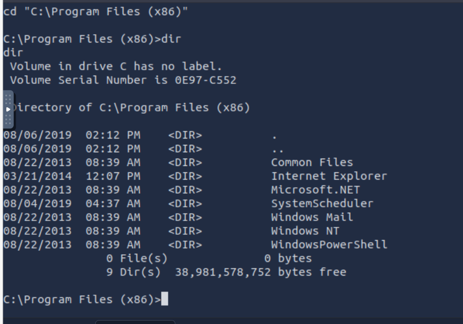

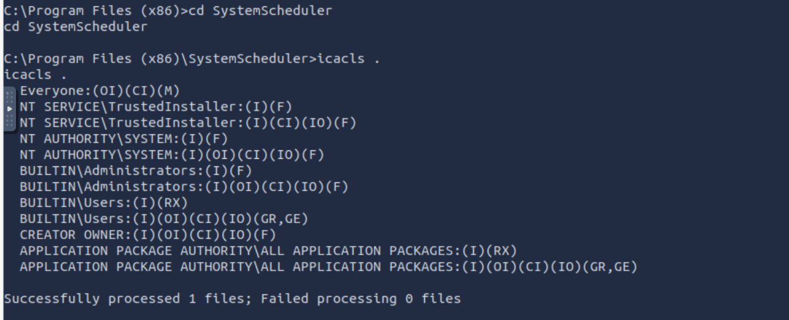

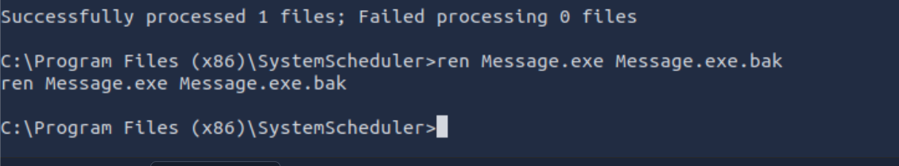

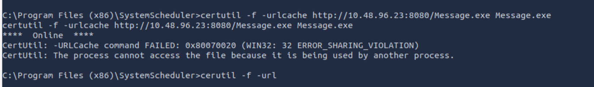

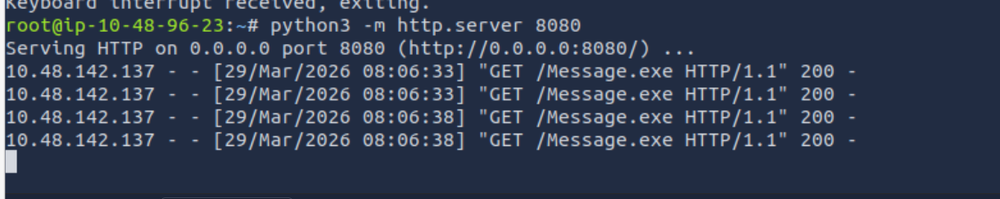

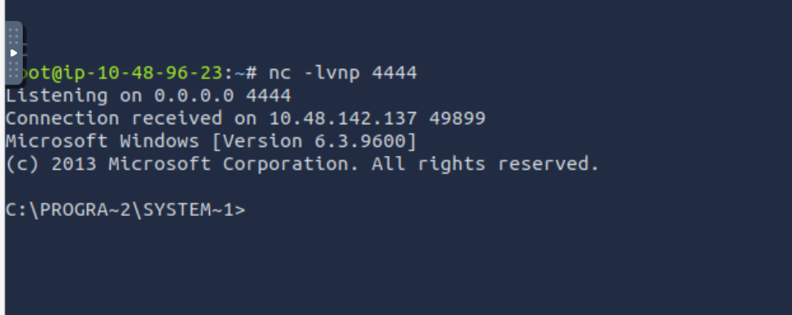

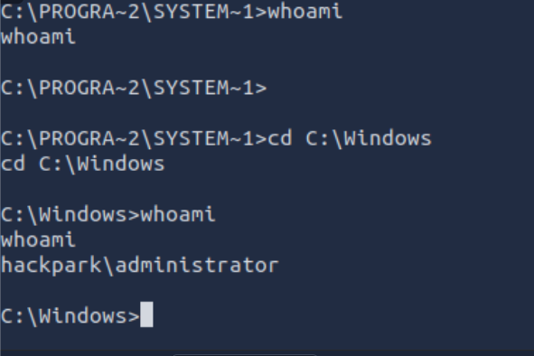

## Task 4: Windows Privilege Escalation

Q7) What is the OS version of this windows machine?

**Ans** Windows 2012 R2 (6.3 Build 960)

Q8) Can you spot a service running some automated task that could be easily exploited? What is the name of this service?

**Ans** WindowsScheduler

Q9) What is the name of the binary you're supposed to exploit?

**Ans** 


