# HackPark - THM 

HackPark teaches how a real-world Windows system can be compromised step by step, starting from initial reconnaissance to full system control. In this room, we first perform enumeration using tools like Nmap to discover open ports and running services, which helps identify a vulnerable web application (BlogEngine.NET). We then exploit this web vulnerability by uploading a malicious file (such as an ASPX reverse shell) to gain initial access to the target machine. Once a reverse shell is obtained, we move to post-exploitation, where we explore the system, identify users, and gather important information. The next major concept is privilege escalation, where tools like winPEAS are used to find misconfigurations such as weak service permissions. By exploiting these weaknesses—like replacing a writable service executable and restarting the service—we gain higher privileges, ultimately achieving Administrator or SYSTEM access. Overall, HackPark teaches the complete attack chain: reconnaissance, exploitation, gaining a shell, enumeration, and privilege escalation to fully compromise a Windows machine.

## Task 1 - Deploy the vulnerable Windows Machine 

Q1) Deploy the Machine and connect to our network

 ```bash
nmap -sV -sC -Pn -oN nmap_basic.txt 10.49.171.122
```
This command is used to scan a target machine to identify open ports, running services, and their versions, while saving the results for later analysis.

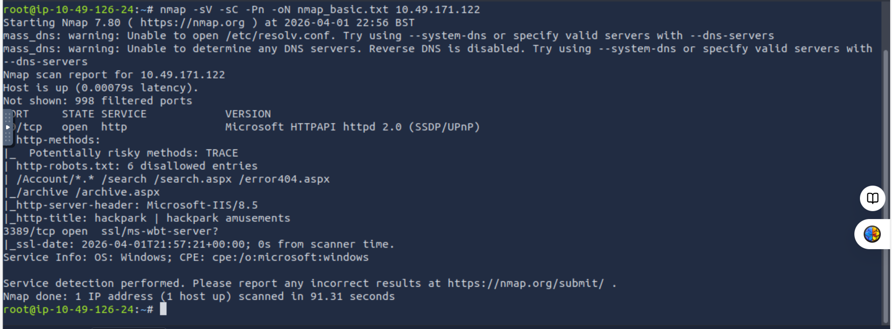

While that is running we also can check out the webserver here:

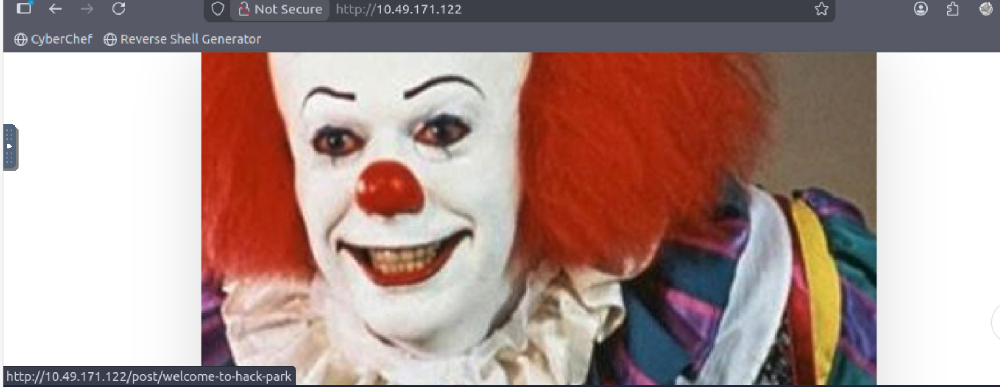

**Ans:** No answer needed

Q2) Whats the name of the clown displayed on the homepage?

**Ans:** pennywise

## Task 2 - Using Hydra to brute-force a login

Q3) We need to find a login page to attack and identify what type of request the form is making to the webserver. Typically, web servers make two types of requests, a GET request which is used to request data from a webserver and a POST request which is used to send data to a server.

You can check what request a form is making by right clicking on the login form, inspecting the element and then reading the value in the method field. You can also identify this if you are intercepting the traffic through BurpSuite (other HTTP methods can be found here (opens in new tab)).

What request type is the Windows website login form using?

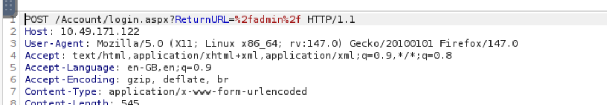

**Ans:**  POST

Q4) Now we know the request type and have a URL for the login form, we can get started brute-forcing an account.

Run the following command but fill in the blanks:

hydra -l username> -P /usr/share/wordlists/<wordlist ip http-post-form

Guess a username, choose a password wordlist and gain credentials to a user account!

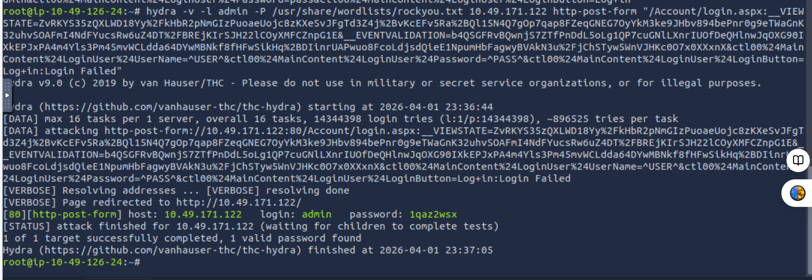

- Used to **brute-force login credentials** on web applications  
- Automates trying multiple **username/password combinations**  
- Helps find **valid credentials quickly**  
- Useful when **no SQL Injection or direct bypass is possible**  
- Saves time compared to manual login attempts  
- Identifies **weak passwords** in authentication systems  

- In this case, Hydra successfully found:
**admin : 1qaz2wsx**

**Ans:** 1qaz2wsx

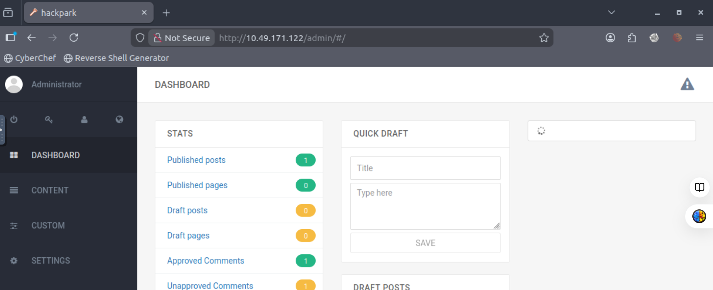

## Task 3 - Compromise the machine 

Q5) Now you have logged into the website, are you able to identify the version of the BlogEngine?

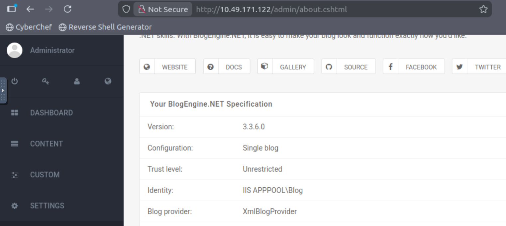

**Ans:** 3.3.6.0

Q6) Use the exploit database archive (opens in new tab) to find an exploit to gain a reverse shell on this system.

What is the CVE?

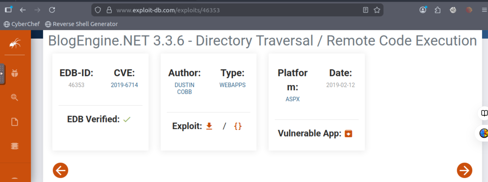

**Ans:** CVE-2019-6714

Q7) Using the public exploit, gain initial access to the server.

Who is the webserver running as?

 **Prepare Reverse Shell**
- Create/Edit `.ascx` file (e.g., `PostView.ascx`)
- Add reverse shell code with:
  - 10.49.126.24
  - 4445

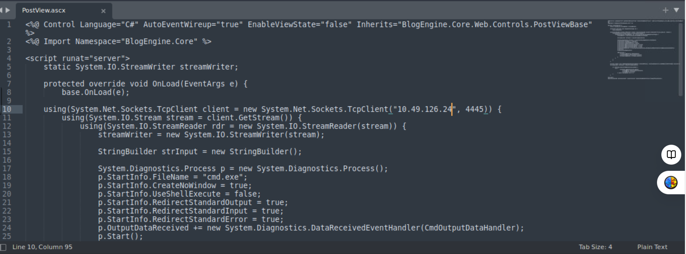

**Upload Malicious File**
- Upload `PostView.ascx` via file manager
- Ensure file appears in `/App_Data/files`


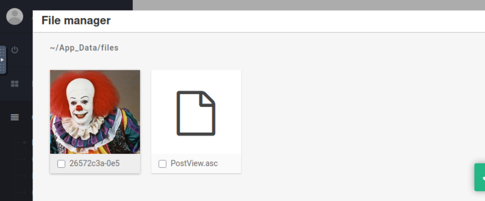


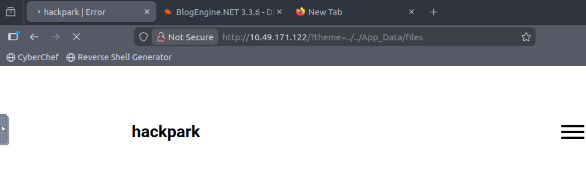

Start Listener
```bash
nc -lvnp 4445
```

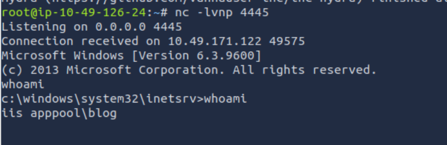

**Ans:** iis apppool\blog

## Task 4 - Windows Privilege Escalation 

Q8) Our netcat session is a little unstable, so lets generate another reverse shell using msfvenom. If you don't know how to do this, I suggest checking out the Metasploit module!

Tip:You can generate the reverse-shell payload using msfvenom, upload it using your current netcat session and execute it manually!

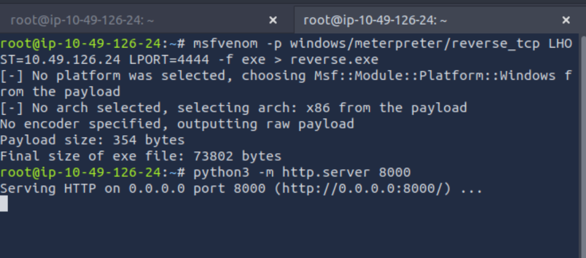


